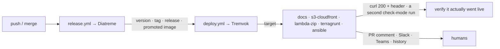

# Tremvok

<!-- sources: action.yml, README.md -->

One GitHub Action for the whole deploy side. It's the counterpart to
[Diatreme](https://github.com/MagmaMoose/diatreme).

Diatreme answers *"what version, and is it released?"*. Tremvok answers *"get that live,
prove it, and tell everyone."*

Pick a target, pass that target's inputs. An input belonging to a different target is a hard
error naming both, raised before the checkout. That's what keeps one listing able to
describe five jobs honestly.

## Start here

- **[Setup](setup.md)**: the workflow for each target, the IAM role, and the secrets. Start
  here to add a `deploy.yml` to a repository.
- **[Action reference](action-reference.md)**: every input and output, which target each one
  applies to, and the permissions each target needs. Generated from `action.yml`.
- **[Migrating to v2](migration.md)**: if you are on `@v1` or on the `deploy/` entry point.
- **[Architecture](architecture.md)**: how the pieces fit, and the specific production failure
  each guard exists to prevent.
- **[API reference](api.md)**: the deployment-record service: endpoints, the OIDC model, the
  storage schema.
- **[Infrastructure](https://github.com/MagmaMoose/tremvok/blob/main/terraform/README.md)**:
  the free-tier accounting, the cost ceiling, and what a LocalStack run does not prove.

## What Tremvok is not

**It does not build your app.** The build is legitimately per-product. One repository stages a
static site with a Python script, another bakes an API base URL into a Vite bundle, a third
vendors a core package. The [standard](https://github.com/MagmaMoose/standard) repository
already draws that line. Tremvok picks up *after* `npm run build` and owns everything from
there.

**It does not cut versions or releases.** That is Diatreme.

**It does not reconcile GitOps.** Where a service is deployed by a cluster-side reconciler,
Tremvok's job is to report and verify, not to apply.
