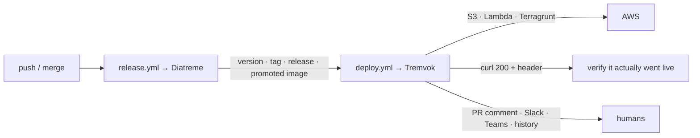

# Tremvok

Deployment orchestration and notifications for MagmaMoose — the deploy-side counterpart to
[Diatreme](https://github.com/MagmaMoose/diatreme).

Diatreme answers *"what version, and is it released?"*. Tremvok answers *"get that artifact
live, prove it, and tell everyone."*

## Start here

- **[Action reference](action.md)** — every input and output, per target. This is what you need
  to add a `deploy.yml` to a repository.
- **[Architecture](architecture.md)** — how the pieces fit, and the specific production failure
  each guard exists to prevent.
- **[API reference](api.md)** — the deployment-record service: endpoints, the OIDC model, the
  storage schema.
- **[Infrastructure](https://github.com/MagmaMoose/tremvok/blob/main/terraform/README.md)** —
  the free-tier accounting, the cost ceiling, and what a LocalStack run does not prove.

## What Tremvok is not

**It does not build your app.** The build is legitimately per-product — one repository stages a
static site with a Python script, another bakes an API base URL into a Vite bundle, a third
vendors a core package — and the [standard](https://github.com/MagmaMoose/standard) repository
already draws that line. Tremvok picks up *after* `npm run build` and owns everything from
there.

**It does not cut versions or releases.** That is Diatreme.

**It does not reconcile GitOps.** Where a service is deployed by Flux, Tremvok's job is to
report and verify, not to apply.
